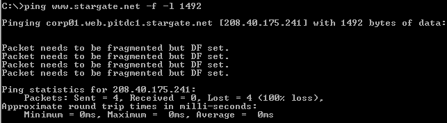
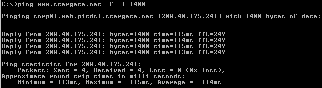

## MTU Ping Test

A series of ping tests using the command, ping www.startgate.net -f -l xxxx, where xxxx is the packet size, can be used to determine the optimal MTU for your connection.

# Step 1

Go to “Start” and select “Run”.

# Step 2

Type in “cmd” (Windows 2000/XP) or “command” (Windows 98/ME) into the “Open:” field. Hit the enter key or click “OK”. The DOS prompt should open.

# Step 3

At the DOS prompt, type in “ping www.stargate.net -f -l 1492” and hit the Enter key.

# Step 4

Note the results above indicate that the packet needs to be fragmented. Lower the size the packet in increments of +/-10 (e.g. 1472, 1462, 1440, 1400) until you have a packet size that does not fragment.

# Step 5

Begin increasing the packet size from this number in small increments until you find the largest size that does not fragment. Add 28 to that number (IP/ICMP headers) to get the optimal MTU setting. For example, if the largest packet size from ping tests is 1462, add 28 to 1462 to get a total of 1490 which is the optimal MTU setting.

# Step 6

Change the MTU using DrTCP or editing the registry. See MTU Settings for further information.

