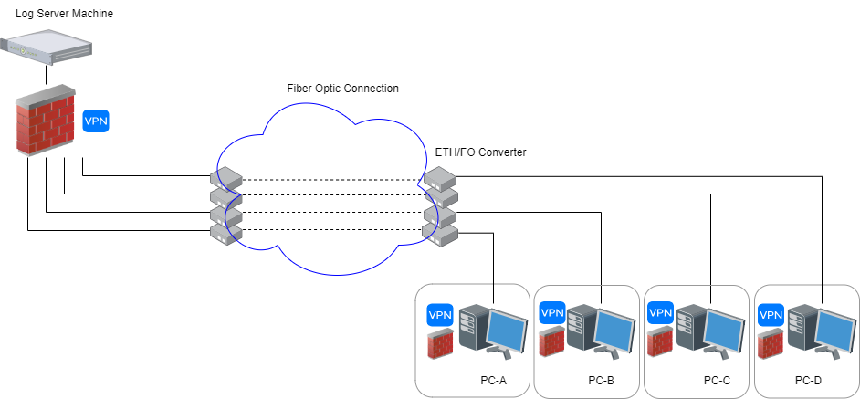

# WireGuard installer for Gaming and PI Nodos or Crypto servers
**Hardware Crypto
WireGuard uses ChaCha20Poly1305, which is extremely fast in software on virtually all general purpose CPUs. As of writing, there is not an overwhelming amount of dedicated hardware support for it, though this is changing. Practically speaking, this is not a problem, as vector instructions on CPUs wind up being in the same ballpark (and sometimes even faster) than AES-NI instructions.**
 


**While using the Pi-node applications on your PCs, you will need to open a range of TCP ports from 31400-31409, usually these ports are blocked on a local ISP network. Only a reliable VPN can help you in this case.**
**You will get open all the ports you need for your PI NODE**
**PI the bonus earning criteria?**

***There are 3 criteria.***
    **1 Number of CPU cores of your processor.
    2 Pi Node app uptime (power or internet disconnection affects this time).
    3 Having ports 31400-31409 open.**

**Pi is a new digital currency developed by Stanford PhDs, with over 55 million members worldwide. 
To claim your Pi, 
follow this link https://minepi.com/coleganet and use my username (coleganet) as your invitation code.**


**You earn bonus according to these 3 criteria and you can earn more pi accordingly. Having a very high RAM or internet speed does not add much extra bonus. Enough RAM and a stable internet line that is not too slow is sufficient.**

**Is it important to open a port?**
**There are 2 types of nodes; Normal Node and Super Node. To become a Super Node, you need to open port. Also, opening a port is one of the bonus criteria. You get more bonuses when the port is open.**


**This project is a bash script that aims to setup a (https://github.com/Coleganet/wireguard_PI)) VPN that is specified for PERSONAL PI Nodos, gaming or torrenting use. It supports only ONE WireGuard client as of now!**

If you are looking for a common WireGuard install script that supports multi-client connections, i.e. multiple devices connect to the VPN at the same time, please visit [this repository](https://github.com/angristan/wireguard-install/) to continue.

## What it does

#### Before using WireGuard


#### After using WireGuard


### NAT Improvement

Client connects to it will immediately achieve a **Full Cone** NAT, the optimal network type for gaming and torrenting. (How to check my NAT type in Win10 ? Use this tool [NatTypeTester](https://github.com/HMBSbige/NatTypeTester)).

With this script, you do not need to enable port forwarding on your router, you do not need the DMZ setting. All the magic happens inside Wireguard. Simply speaking: 

>The local ports will be forwarded to the server directly.

It solves the following scenarios:

1. You want to host a Minecraft/Terraria, etc. server online and play with your friend, but you cannot figure out how to enable port forwarding on your router, or your ISP just did not give you a public IP address.

2. You play a P2P game like Monster Hunter: World or Overcooked! but your NAT type prevents you from connecting with other players. 

For a better gaming experience, the server should be close to your living region and has a low ping value. You should ping the provider's looking glass datacenter IP first before purchasing a VPS.

## Server Public IP problem

This script need to run on a server with a public IP address.

At the beginning of the installation, the script will ask for this public IP address.

Normally the server public IP should be populated automatically, however for some cloud providers like Google Cloud Platform and Oracle Cloud, the auto value is NOT the correct public IP address, but a subnet IP address (usually starts with `10.*.*.*`).

In these cases you need to change the value to what your server's acutal public IP is.

## Port Forwarding

The script **Port Forwards** the local port `53`, `88`, `80`, `500`(4 ports for XBOX LIVE) and `1024-65000` to the corresponding ports on the server side. These ports covered most of the ports used by any games. **Please make sure that there is no other application using these ports on the server, otherwise It will deafen any application that listens to these ports.** I highly suggest running this script on an new empty system. 

Specifically, if the SSH port is inside the range, the script will automatically move it to port `65432` for not losing access to the server after installation.

The script supports both IPv4 and IPv6.

WireGuard does not fit your environment? Check out [openvpn-install](https://github.com/angristan/openvpn-install).

Most part of this script is based on the angristan's [wireguard-install](https://github.com/angristan/wireguard-install/), because I am a new shell programmer so any improvement pull request is welcomed!

## Clients

  You can download the classic client for Windows, Linux or MAC and Android
  
  Wireguard Client Download Links https://download.wireguard.com/windows-client/
  
  Wireguard Public Page https://www.wireguard.com/
  
  Wireguard Github https://github.com/WireGuard

  If you need a more advance clients with tunneling your ports I recommend Wiresock 
  
  Wiresock for Download https://www.wiresock.net/wiresock-vpn-client/download
  
  Public Page https://www.wiresock.net/
  
  Wiresock Github https://github.com/wiresock/WireSockUI

 ## CLIENTS DEBIAN UBUNTU
 Pre-requisites
In order to work properly, the application needs the following dependencies:
 
sudo apt install libcanberra-gtk-module libjavascriptcoregtk-4.0-18 libicu* libwebkit2gtk-4.0-37 wireguard resolvconf

Them follow the Installation for a Nice client in Debian 

https://github.com/leon3s/wireguard-gui

## Customize the forwarding ports

The reason why it is full cone is due to the DNAT route rules in the iptables:

After the installation, in `etc/wireguard/add-fullcone-nat.sh` you can find:

```bash
# PostUp sricpt example
# DNAT 53,80,88,500, 1024 to 65000

### bla bla bla ###
iptables -t nat -A PREROUTING -i ${SERVER_PUB_NIC} -p udp --dport 53 -j DNAT --to-destination ${CLIENT_WG_IPV4}:53
iptables -t nat -A PREROUTING -i ${SERVER_PUB_NIC} -p udp --dport 80 -j DNAT --to-destination ${CLIENT_WG_IPV4}:80
iptables -t nat -A PREROUTING -i ${SERVER_PUB_NIC} -p udp --dport 88 -j DNAT --to-destination ${CLIENT_WG_IPV4}:88
iptables -t nat -A PREROUTING -i ${SERVER_PUB_NIC}-p udp --dport 500 -j DNAT --to-destination ${CLIENT_WG_IPV4}:500
iptables -t nat -A PREROUTING -i ${SERVER_PUB_NIC} -p udp --dport 1024:65000 -j DNAT --to-destination ${CLIENT_WG_IPV4}:1024-65000
iptables -t nat -A PREROUTING -i ${SERVER_PUB_NIC} -p tcp --dport 53 -j DNAT --to-destination ${CLIENT_WG_IPV4}:53
iptables -t nat -A PREROUTING -i ${SERVER_PUB_NIC} -p tcp --dport 80 -j DNAT --to-destination ${CLIENT_WG_IPV4}:80
iptables -t nat -A PREROUTING -i ${SERVER_PUB_NIC} -p tcp --dport 88 -j DNAT --to-destination ${CLIENT_WG_IPV4}:88
iptables -t nat -A PREROUTING -i ${SERVER_PUB_NIC}-p tcp --dport 500 -j DNAT --to-destination ${CLIENT_WG_IPV4}:500
iptables -t nat -A PREROUTING -i ${SERVER_PUB_NIC} -p tcp --dport 1024:65000 -j DNAT --to-destination ${CLIENT_WG_IPV4}:1024-65000

ip6tables -t nat -A PREROUTING -i ${SERVER_PUB_NIC} -p udp --dport 53 -j DNAT --to-destination [${CLIENT_WG_IPV6}]:53
ip6tables -t nat -A PREROUTING -i ${SERVER_PUB_NIC} -p udp --dport 80 -j DNAT --to-destination [${CLIENT_WG_IPV6}]:80
ip6tables -t nat -A PREROUTING -i ${SERVER_PUB_NIC} -p udp --dport 88 -j DNAT --to-destination [${CLIENT_WG_IPV6}]:88
ip6tables -t nat -A PREROUTING -i ${SERVER_PUB_NIC}-p udp --dport 500 -j DNAT --to-destination [${CLIENT_WG_IPV6}]:500
ip6tables -t nat -A PREROUTING -i ${SERVER_PUB_NIC} -p udp --dport 1024:65000 -j DNAT --to-destination [${CLIENT_WG_IPV6}]:1024-65000
ip6tables -t nat -A PREROUTING -i ${SERVER_PUB_NIC} -p tcp --dport 53 -j DNAT --to-destination [${CLIENT_WG_IPV6}]:53
ip6tables -t nat -A PREROUTING -i ${SERVER_PUB_NIC} -p tcp --dport 80 -j DNAT --to-destination [${CLIENT_WG_IPV6}]:80
ip6tables -t nat -A PREROUTING -i ${SERVER_PUB_NIC} -p tcp --dport 88 -j DNAT --to-destination [${CLIENT_WG_IPV6}]:88
ip6tables -t nat -A PREROUTING -i ${SERVER_PUB_NIC}-p tcp --dport 500 -j DNAT --to-destination [${CLIENT_WG_IPV6}]:500
ip6tables -t nat -A PREROUTING -i ${SERVER_PUB_NIC} -p tcp --dport 1024:65000 -j DNAT --to-destination [${CLIENT_WG_IPV6}]:1024-65000
```


If the game needs port that is not covered inside, you can modify the postup and postdown script yourself to add a certain port for it.

* Run the script and **STOP** the wireguard service.
* Modify `add-fullcone-nat.sh`, `rm-fullcone-nat.sh` according to your need.
* Run the script and **RESTART** the wireguard service.
 
## Requirements

Main branch supported distributions:

- Debian >= 11
- Ubuntu >= 20.04 (*Preferred*)

The main branch only works on **KVM** instances. If you are using cloud service from Google, AWS or Oracle, etc. They are based on **KVM** virtualization technology.

Another popular VPS type is **OpenVZ** which usually comes cheaper than **KVM**. If you have this type of machine, unfortunately you cannot run the original WireGuard that requires extra linux kernel module.

However it is still possible to use a userspace WireGuard implementation, for example [wireguard-go](https://github.com/WireGuard/wireguard-go) or [BoringTun](https://github.com/cloudflare/boringtun). Sometimes these userspace implementations are even faster, according to [tests](https://www.reddit.com/r/WireGuard/comments/14r6uf9/i_did_some_benchmarks_of_linux_wireguard/).

### For OpenVZ instances

* Enable TUN/TAP linux driver on your VM management panel, or contact your provider to enable it.
* Compile either [wireguard-go](https://github.com/WireGuard/wireguard-go) or [BoringTun](https://github.com/cloudflare/boringtun).
* Move the compiled binary (either `wireguard-go` or `boringrun-cli`) to `/usr/local/bin`.
* Comment out the installer script line #10-#14, removing the OpenVZ check.
* Run the installer script now.

## Usage

Download and execute the script. You **DO NOT** need to run the script with `root`, but it requires the user to be in the `sudo` group. Answer the questions asked by the script and it will take care of the rest. For most VPS providers, you can just enter through all the questions.

```bash
wget https://raw.githubusercontent.com/Coleganet/wireguard_PI/main/wg-pi-installer.sh
bash ./wg-pi-installer.sh
```

It will install WireGuard (kernel module and tools) on the server, configure it, create a systemd service and a client configuration file.

## Stop / Restart / Uninstal

Run the script again will give you these options!

## CHECK SPEED in your SERVER 

 If migrating from prior bintray install instructions please first...
sudo rm /etc/apt/sources.list.d/speedtest.list

sudo apt-get update

sudo apt-get remove speedtest

Other non-official binaries will conflict with Speedtest CLI
Example how to remove using apt-get
sudo apt-get remove speedtest-cli

"sudo apt-get install curl"
"curl -s https://packagecloud.io/install/repositories/ookla/speedtest-cli/script.deb.sh | sudo bash"
"sudo apt-get install speedtest"

Them at any time run us shell: speedtest 

### ANY MORE PROBLEMS

## EDIT: Please follow these instructions:

Modern Linux distros use systemd-resolved. Therefore, the /etc/resolv.conf file is a symbolic link managed by systemd-resolved. This means the file is dynamically generated and should be edited manually. You can still edit them manually, but the changes are  permanent if you follow the next example:

1. Access /etc/resolv/conf using a text editor. For example, we use Nano:


Execute sudo rm /etc/resolv.conf

Execute sudo touch /etc/resolv.conf

Edit the file with sudo nano /etc/resolv.conf

Add this line to the file: nameserver 1.1.1.1

Press ctrl + s to save and ctrl + x to exit

Restart the service:

sudo systemctl restart systemd-resolved.service

## If you still have problems with the bandwidth please add the Lines MTU = 1420 and PersistentKeepalive = 25 in wg0.conf

First Calculate your MTU follow this document https://github.com/Coleganet/wireguard_PI/blob/main/MTU.md

WG-server
```
# /etc/wireguard/wg0.conf
[Interface]
Address = 10.x.x.1/24
Address = fd42:x:xx::1/64
MTU = 1420
SaveConfig = true
PostUp = /etc/wireguard/add-fullcone-nat.sh
PostDown = /etc/wireguard/rm-fullcone-nat.sh
ListenPort = 65354
PrivateKey = xxxxxxxxxxxxxxxxxx

[Peer]
PublicKey = xxxxxxxxxxxxxxxxxx
AllowedIPs = 172.123.0.2/32
Endpoint = X.X.X.X:61426
PersistentKeepalive = 25

# In the CLIENT configuration add MTU = 1384 us example below and PersistentKeepalive = 5
You just change the value according to the previous test

# WG-peer

# /etc/wireguard/wg0.conf

[Interface]
PrivateKey = xxxxxxxxxxxxxxxxxx
ListenPort = 51820
Address = 172.123.0.2/24
MTU = 1384

[Peer]
PublicKey = xxxxxxxxxxxxxxxxxx
AllowedIPs = 172.123.0.0/24, 10.1.0.0/24
Endpoint = Y.Y.Y.Y:51820
PersistentKeepalive = 5


### Conclusions
* As you can see in the image, the original MTU setting of 1420 for both peer and server gives abysmal bandwdith.
* I found that that MTU 1384 on the WG peer with 1420 on the WG server seems to almost have the best bandwidth.
* For WG Peer MTU 1384, the max upload bandwidth of 50Mbps of my ISP connection is achieved but I was only able to hit 550 Mbps for the download bandwidth where the max download bandwidth of my ISP connection is 1000 Mbps. This reduction in download bandwidth might be due to other factors.
